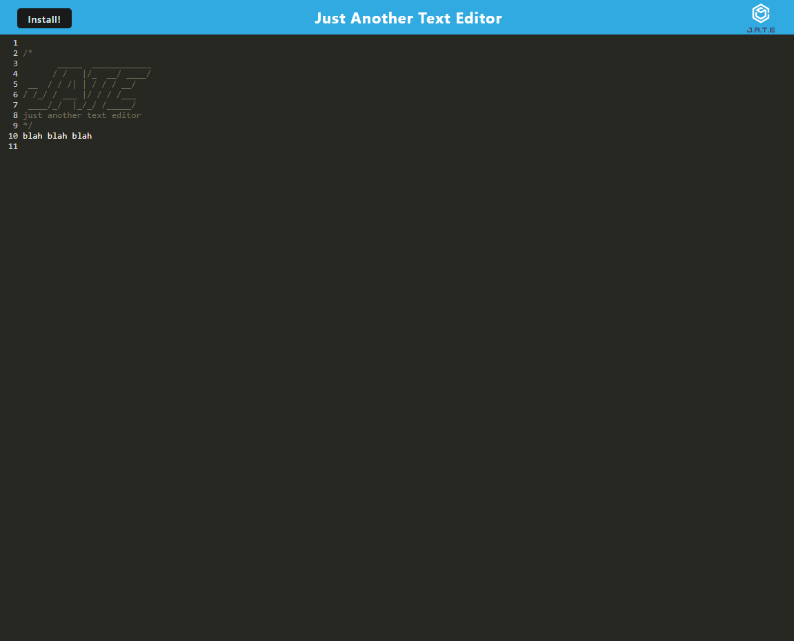

# PWA TEXT EDITOR

# Description

This application is a simple text editor that you can run in the browser, or install as a web application on your computer.

# Table of Contents

- [Installation](#installation)
- [Usage](#usage)
- [Contributing](#contributing)
- [Questions](#questions)

# Installation

You can use the text editor in the browser, or press install to download the web app to run locally on your computer.

# Usage

Type text! The application automatically saves as user types.

# Contributing

This homework was completed in class. Thanks to the instructors!

# Questions

For further information:

- GitHub:

  - [https://github.com/cadienlake](https://github.com/cadienlake)

- Email:
  - cadienlake@gmail.com

# Screenshot

